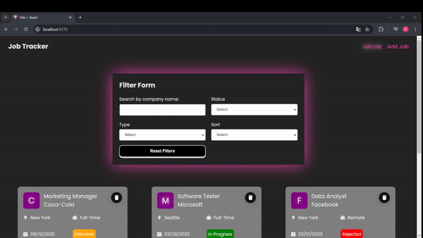

<h1>JOB-TRACKER</h1> 

This project is a job tracking application that allows users to log their job applications by entering details such as company, location, and job type. Users can track their applications and manage them efficiently. The tracking screen includes advanced filtering options that allow users to refine their job list based on specific criteria. These include filtering by company name, location, job type, and other relevant details, making it easier to manage and find the desired applications.

<h2>Features</h2> 

<ul> 

<li>Developed using React for building dynamic and interactive user interfaces.</li>
<li>State management powered by Redux Toolkit, enabling efficient and centralized data handling.</li> 
<li>Sorting options to organize job applications based on different criteria.</li> 
<li>Styled with SCSS for modular and maintainable styling.</li> 
<li>Implemented notifications using React Toastify for improved user feedback.</li> 
<li>API requests managed with Axios for reliable and efficient communication with the backend.</li> 
<li>Component testing ensures the reliability and performance of critical features.</li>
<li>Responsive design for compatibility with various devices and screen sizes.</li> 

</ul> 

<h2>Screen Gif</h2>

